# Order Flow
This project models BTCUSDT trade-arrival times (Binance UM futures) with Poisson and Hawkes point processes, focusing on intraday seasonality and self-exciting/long-memory clustering.

Results show large likelihood gains from self-excitation, with power-law kernels outperforming exponential Hawkes, while robust-vs-Hessian SE gaps indicate remaining misspecification.

**Concepts**: Maximum Likelihood Estimation (MLE), Hawkes, Numerical Stability, Identifiability, Robust Statistics, Automatic Differentiation (AD, JAX), Market Microstructure

## Key Contributions
* Exact likelihood for 1ms timestamp collisions (no jittering)
* Robust SE via Godambe + identifiability diagnostics via inverse Hessian
* JAX MLE with exact gradients + Hessians

## Highlights
<p align="center">
  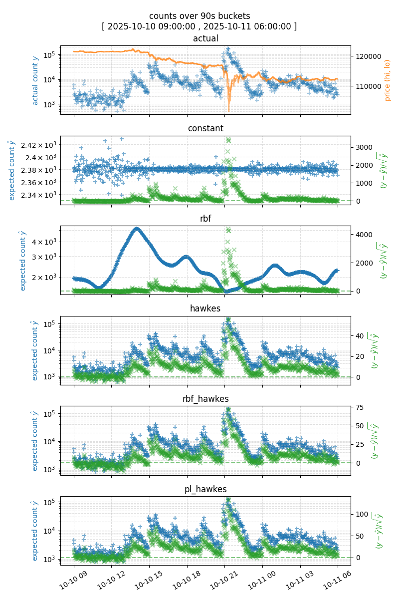
  <br>Fig 1: Comparison of model outputs
</p>

<p align="center">
  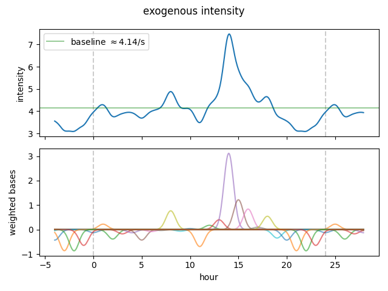
  <br>Fig 2: Baseline fluctuation in trades based on time of day
</p>

<p align="center">
  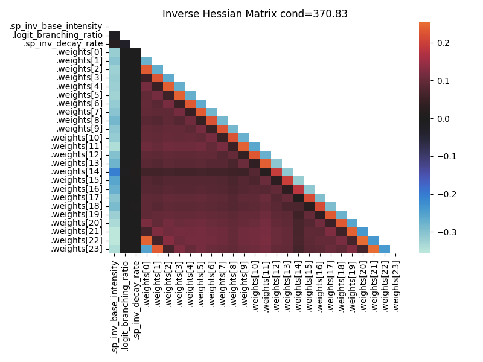
  <br>Fig 3: Inverse Hessian: high absolute values suggest potential identifiability issues
</p>

### Iterative Model Development
1. `Constant intensity` with Poisson baseline
1. `Daily seasonality` with periodic radial basis functions
1. `Self-excitation` with Hawkes process
1. `Long-memory` with power-law decay kernel

### Statistical Diagnostics
1. `Inverse Hessian Matrix` helps detect weak identifiability and local collinearity between parameters
1. `Godambe Information Matrix` provides standard errors which are robust to model misspecification

### Efficiency
1. `Computational complexity reduction`
    1. $O(n^2) \to O(n)$ time for power-law decay calculation using sum-of-exponentials approximation
    1. $O(n) \to O(\log n)$ parallel span for exponential decay calculation, $h_i = e^{-\lambda \Delta t} h_{i-1} + 1$, using parallel prefix scan on a linear recurrence  (`jax.lax.associative_scan` in `decayed_counts.py`)
1. `Gradient-based optimization`
    1. Used Automatic Differentiation (AD) to eliminate manual derivation of log-likelihood gradients for kernels
    1. Compute the exact Hessian for diagnostics, avoiding the numerical instability of finite-difference methods
1. `Property-based testing` ensures power-law approximation remains accurate over valid inputs (`hypothesis` library in `power_law_approx.py`)
1. `Automated report generation` reduces room for human error when producing reports such as this file (`Jinja2` library in `generate_reports.py`)

## Scope
The scope is restricted to conditional intensity estimation for point processes.

Although the implementation handles tens of millions of events, the emphasis is on statistical fit and model diagnostics rather than system performance.

The analysis does not cover price dynamics, alpha generation, or backtesting.


## Data
This project uses [Binance UM futures trade data](https://data.binance.vision/data/futures/um/daily).
* instrument: `BTCUSDT` USDM futures
* train dates: `2025-09-01` to `2025-09-30`
* validation dates: `2025-10-01` to `2025-10-15`
* timestamp resolution: 1 millisecond; multiple trades may share the same timestamp

<div align="center">

|         id |   price |   qty |   quote_qty |          time | is_buyer_maker   |
|------------|---------|-------|-------------|---------------|------------------|
| 6600619967 |  108208 | 0.002 |     216.417 | 1756684800076 | False            |
| 6600619968 |  108208 | 0.009 |     973.875 | 1756684800283 | True             |
| 6600619969 |  108208 | 0.006 |     649.25  | 1756684800283 | True             |
| 6600619970 |  108208 | 0.044 |    4761.17  | 1756684800639 | True             |
| 6600619971 |  108208 | 0.05  |    5410.41  | 1756684800639 | True             |

Table 1: Raw data
</div>

<div align="center">

| subset     | n_events   | n_unique_timestamps   |
|------------|------------|-----------------------|
| train      | 68,534,083 | 17,383,302            |
| validation | 64,626,641 | 14,826,005            |

Table 2: Sample counts
</div>

It is unclear whether each record corresponds to a single aggressive order or a single passive fill. From the documentation of a [similar dataset](https://developers.binance.com/docs/binance-spot-api-docs/web-socket-streams#trade-streams) and visualisations, it seems that (2) is more likely. This implies that we could be modelling `arrival of distinct passive order fills`, rather than `arrival of distinct decisions to cross the spread`.

## Modelling Assumptions
To be addressed in [Known Limitations and Future Work](#known-limitations-and-future-work) section.

### Stationarity
The estimated parameters are assumed to remain constant.

### Multiple Events per Timestamp
This project assumes order arrivals follow a point process with the following log likelihood:

$$
\log L(\theta) = \sum_i \log \lambda_\theta( t_i ) - \int_0^T \lambda_\theta(s) ds
$$

where
* $\lambda_\theta(t)$ is the conditional intensity given the event history up to time $t$.

Timestamps have `1ms` resolution and each timestamp may have multiple events. For Hawkes models, these events are assumed to be conditionally iid and therefore arrive "instantaneously" but sequentially. This is included in the log likelihood using the Rising Factorial (Pochhammer) polynomial:

$$
\begin{align}
\log \lambda (t) &= \sum_{j=0}^{n-1} \log \lambda_j(t) \\
    &= \sum_{j=0}^{n-1} \log( \phi_0 + D_t J + j J) \\
    &= \sum_{j=0}^{n-1} \log( a + j d) \\
    &= n \log d  + \log\Gamma(\frac a d + n) - \log\Gamma(\frac a d)
\end{align}
$$

where
* $n$ is the number of events with timestamp $t$
* $\phi_0$ is the base intensity
* $D_t$ is the decayed sum of events right before $t$
* $J$ is the jump size
* $\lambda_0(t) = \phi_0 + D_t J$
* $\lambda_1(t) = \phi_0 + D_t J + J$
* $\lambda_k(t) = \phi_0 + D_t J + k J$
* $a := \phi_0 + D_t J$ is the pre-computed intensity contribution from history
* $d := J$

This formulation allows the likelihood to be calculated exactly even when multiple events arrive at the same timestamp, and avoids discarding information or artificially jittering timestamps to increase the data size.

## Results

### Log Likelihood
<div align="center">

| subset     |   constant |   rbf |   hawkes |   rbf_hawkes |   pl_hawkes |
|------------|------------|-------|----------|--------------|-------------|
| train      |       8.97 |  9.17 |    16.65 |        21.31 |       30.12 |
| validation |      11.96 | 12.04 |    20.14 |        24.98 |       34.75 |

Table 3: Mean log likelihood per timestamp
</div>

<div align="center">

| subset     | constant   | rbf   | hawkes   | rbf_hawkes   | pl_hawkes   |
|------------|------------|-------|----------|--------------|-------------|
| train      | 0.00%      | 2.22% | 85.64%   | 137.62%      | 235.86%     |
| validation | 0.00%      | 0.61% | 68.33%   | 108.79%      | 190.44%     |

Table 4: Mean log likelihood per timestamp relative to constant baseline
</div>

Validation log likelihood is consistently higher than training log likelihood. This is expected as the validation dataset includes `2025-10-10`, when the market was particularly active.

### Validation QQ Plots
<p align="center">
  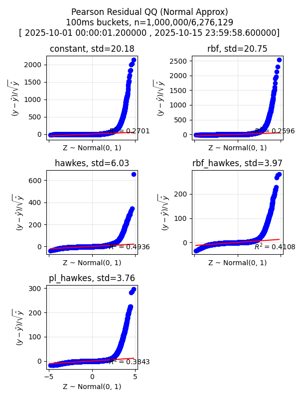
  <br>Fig 4: QQ plots of normalised residuals
</p>

All the models have heavy right tails, meaning they underestimate the rate of trades. The self-exciting models perform better.

### Validation Time Series Plots
<p align="center">
  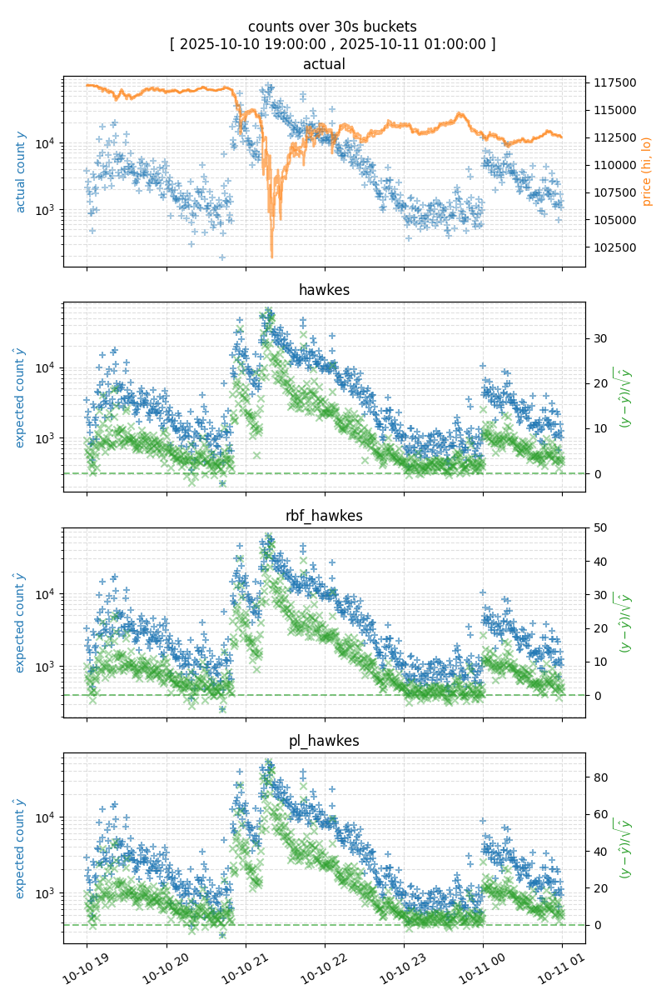
  <br>Fig 5: 2025-10-10
</p>

<p align="center">
  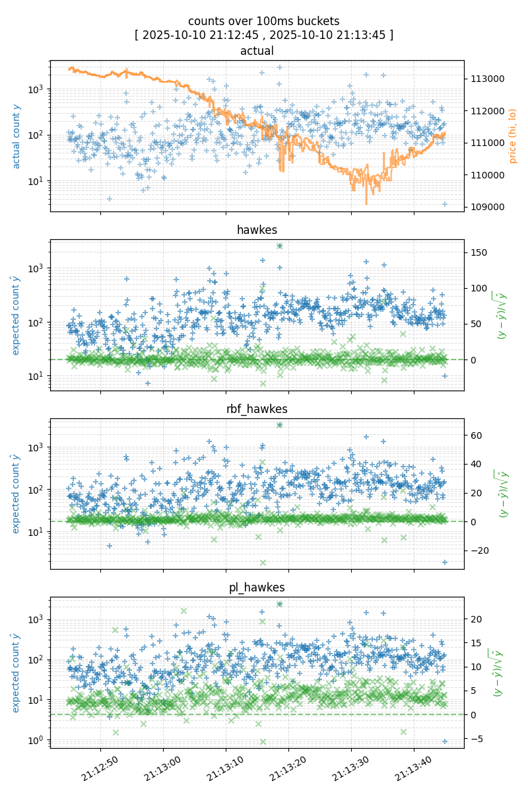
  <br>Fig 6: 2025-10-10 zoomed in
</p>

The residuals seem to follow the same pattern as the expected counts at higher aggregation levels, but that behaviour disappears after zooming in.

### Estimated Parameters (Click to Expand)
Timings are taken on an M1 Max MacBook Pro.

#### constant: 1 param(s), training duration: 0.55s (0.03s/eval)
<details>
<summary>Parameters</summary>
<div align="center">

| param                 |   value |
|-----------------------|---------|
| sp_inv_base_intensity | 26.4407 |
| base_intensity        | 26.4407 |

Table 5: constant parameters
</div>
</details>
<details>
<summary>Diagnostics</summary>
<div align="center">

|                        |    mean |   hess_se |   robust_se |   z_score | p_value   |   se_ratio |
|------------------------|---------|-----------|-------------|-----------|-----------|------------|
| .sp_inv_base_intensity | 26.4407 |    0.0032 |       0.022 |   1202.19 | 0.00%     |     6.8862 |

Table 6: constant diagnostics
</div>
</details>


<details>
<summary>Predictions</summary>
<p align="center">
  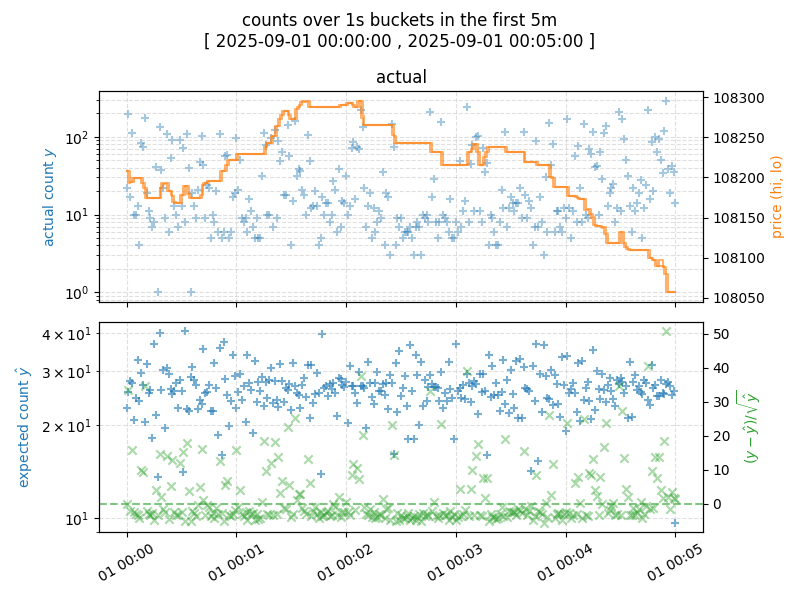
  <br>Fig 9: constant predictions
</p>
</details>

#### rbf: 25 param(s), training duration: 3.34s (0.15s/eval)
<details>
<summary>Parameters</summary>
<div align="center">

| param            | value     |
|------------------|-----------|
| sp_inv_base_rate | 26.227629 |
| weights          | [-3.7549973   2.5041997  -3.0253346  -1.0833539  -2.164065   -6.323172
  0.42495412 -3.5103512   1.8282052  -4.2133617  -4.0384836  -7.328086
 -3.9071794   9.726168   27.495842   12.9098015   2.2567353   0.5450706
  6.8609242  -2.1034384  -1.9483695  -8.141842   -6.910304   -4.7565765 ]           |
| base_rate        | 26.227629 |

Table 7: rbf parameters
</div>
</details>
<details>
<summary>Diagnostics</summary>
<div align="center">

|                   |    mean |   hess_se |   robust_se |   z_score | p_value   |   se_ratio |
|-------------------|---------|-----------|-------------|-----------|-----------|------------|
| .sp_inv_base_rate | 26.2276 |    0.0048 |      0.0219 |   1195.69 | 0.00%     |     4.5687 |
| .weights[0]       | -3.755  |    0.0179 |      0.1165 |    -32.25 | 0.00%     |     6.5063 |
| .weights[1]       |  2.5042 |    0.0189 |      0.1223 |     20.48 | 0.00%     |     6.4628 |
| .weights[2]       | -3.0253 |    0.018  |      0.1187 |    -25.49 | 0.00%     |     6.5999 |
| .weights[3]       | -1.0834 |    0.018  |      0.1208 |     -8.97 | 0.00%     |     6.7188 |
| .weights[4]       | -2.1641 |    0.0179 |      0.1194 |    -18.12 | 0.00%     |     6.6702 |
| .weights[5]       | -6.3232 |    0.0172 |      0.1106 |    -57.19 | 0.00%     |     6.4435 |
| .weights[6]       |  0.425  |    0.0178 |      0.1208 |      3.52 | 0.04%     |     6.7919 |
| .weights[7]       | -3.5104 |    0.0183 |      0.1207 |    -29.09 | 0.00%     |     6.6008 |
| .weights[8]       |  1.8282 |    0.0185 |      0.1204 |     15.19 | 0.00%     |     6.5039 |
| .weights[9]       | -4.2134 |    0.0176 |      0.1145 |    -36.8  | 0.00%     |     6.5127 |
| .weights[10]      | -4.0385 |    0.017  |      0.1068 |    -37.81 | 0.00%     |     6.2857 |
| .weights[11]      | -7.3281 |    0.0163 |      0.1005 |    -72.95 | 0.00%     |     6.1681 |
| .weights[12]      | -3.9072 |    0.0189 |      0.1187 |    -32.92 | 0.00%     |     6.2748 |
| .weights[13]      |  9.7262 |    0.0226 |      0.1523 |     63.86 | 0.00%     |     6.7425 |
| .weights[14]      | 27.4958 |    0.0242 |      0.1595 |    172.43 | 0.00%     |     6.5966 |
| .weights[15]      | 12.9098 |    0.0231 |      0.1465 |     88.12 | 0.00%     |     6.3353 |
| .weights[16]      |  2.2567 |    0.02   |      0.1217 |     18.55 | 0.00%     |     6.0963 |
| .weights[17]      |  0.5451 |    0.0196 |      0.1248 |      4.37 | 0.00%     |     6.3641 |
| .weights[18]      |  6.8609 |    0.0201 |      0.1322 |     51.89 | 0.00%     |     6.5812 |
| .weights[19]      | -2.1034 |    0.0186 |      0.1222 |    -17.21 | 0.00%     |     6.5559 |
| .weights[20]      | -1.9484 |    0.0172 |      0.1146 |    -17.01 | 0.00%     |     6.653  |
| .weights[21]      | -8.1418 |    0.0155 |      0.0993 |    -82.02 | 0.00%     |     6.3979 |
| .weights[22]      | -6.9103 |    0.0158 |      0.1039 |    -66.54 | 0.00%     |     6.5881 |
| .weights[23]      | -4.7566 |    0.0166 |      0.1132 |    -42.03 | 0.00%     |     6.8163 |

Table 8: rbf diagnostics
</div>
</details>

<details>
<summary>Inverse Hessian</summary>
<p align="center">
  
  <br>Fig 10: rbf inverse Hessian
</p>
</details>
<details>
<summary>Convergence</summary>
<p align="center">
  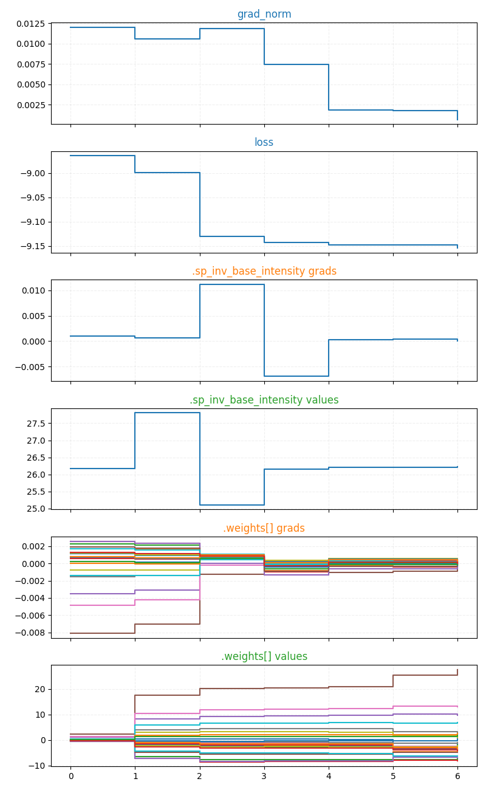
  <br>Fig 11: rbf convergence
</p>
</details>


<details>
<summary>Seasonal Basis Functions</summary>
<p align="center">
  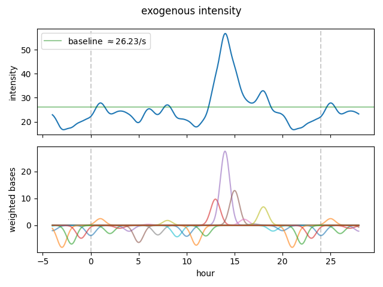
  <br>Fig 13: rbf bases
</p>
</details>

<details>
<summary>Predictions</summary>
<p align="center">
  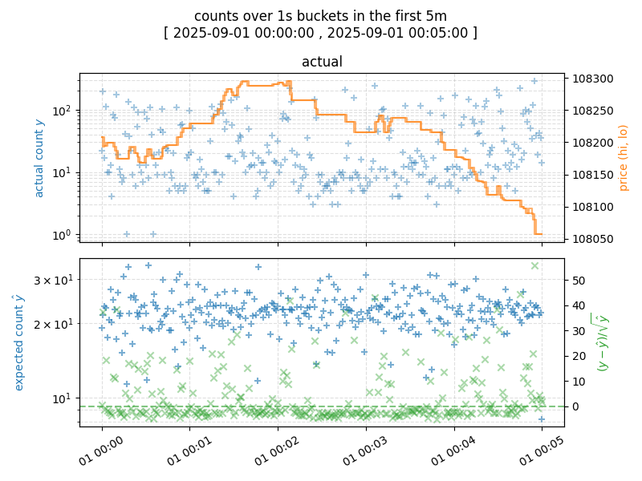
  <br>Fig 12: rbf predictions
</p>
</details>

#### hawkes: 3 param(s), training duration: 16.10s (0.50s/eval)
<details>
<summary>Parameters</summary>
<div align="center">

| param                 |     value |
|-----------------------|-----------|
| sp_inv_base_intensity |  1.7304   |
| logit_branching_ratio |  1.92638  |
| sp_inv_decay_rate     | 12.5844   |
| base_intensity        |  1.89355  |
| branching_ratio       |  0.872848 |
| decay_rate            | 12.5844   |

Table 9: hawkes parameters
</div>
</details>
<details>
<summary>Diagnostics</summary>
<div align="center">

|                        |    mean |   hess_se |   robust_se |   z_score | p_value   |   se_ratio |
|------------------------|---------|-----------|-------------|-----------|-----------|------------|
| .sp_inv_base_intensity |  1.7304 |    0.0011 |      0.0007 |   2394.47 | 0.00%     |     0.6592 |
| .logit_branching_ratio |  1.9264 |    0.0008 |      0.005  |    382.8  | 0.00%     |     6.0568 |
| .sp_inv_decay_rate     | 12.5844 |    0.0016 |      0.0093 |   1356.29 | 0.00%     |     5.7826 |

Table 10: hawkes diagnostics
</div>
</details>

<details>
<summary>Inverse Hessian</summary>
<p align="center">
  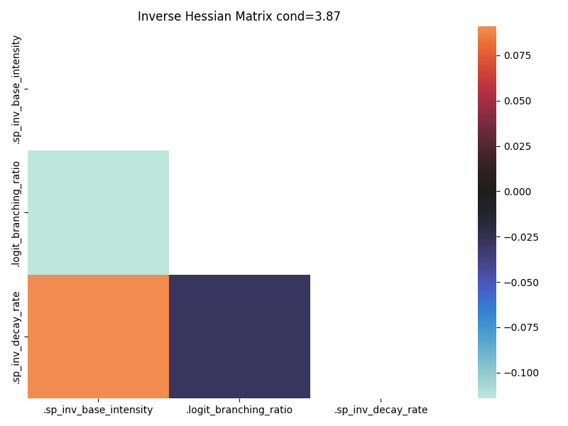
  <br>Fig 14: hawkes inverse Hessian
</p>
</details>
<details>
<summary>Convergence</summary>
<p align="center">
  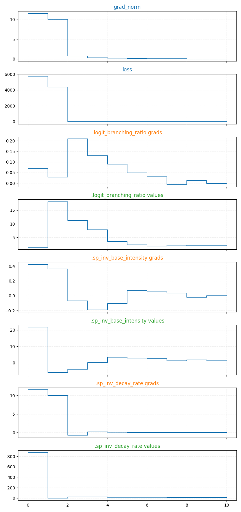
  <br>Fig 15: hawkes convergence
</p>
</details>


<details>
<summary>Predictions</summary>
<p align="center">
  
  <br>Fig 16: hawkes predictions
</p>
</details>

#### rbf_hawkes: 27 param(s), training duration: 25.17s (0.38s/eval)
<details>
<summary>Parameters</summary>
<div align="center">

| param                 | value      |
|-----------------------|------------|
| sp_inv_base_intensity | 4.1194634  |
| logit_branching_ratio | 1.6482091  |
| sp_inv_decay_rate     | 134.00043  |
| weights               | [-0.1231854   0.22192316 -0.3860868  -0.17999588 -0.13385312 -0.432416
 -0.08536145 -0.03888256  0.77217865 -0.06465265  0.0369371  -0.6979831
  0.18838018  0.37541634  3.1273165   1.2030098   0.8386684   0.10322252
  0.5533656  -0.34088692 -0.42202032 -0.8656783  -0.86221856 -0.6439228 ]            |
| base_intensity        | 4.135586   |
| branching_ratio       | 0.83864886 |
| decay_rate            | 134.00043  |

Table 11: rbf_hawkes parameters
</div>
</details>
<details>
<summary>Diagnostics</summary>
<div align="center">

|                        |     mean |   hess_se |   robust_se |   z_score | p_value   |   se_ratio |
|------------------------|----------|-----------|-------------|-----------|-----------|------------|
| .sp_inv_base_intensity |   4.1195 |    0.0038 |      0.0016 |   2561.84 | 0.00%     |     0.4221 |
| .logit_branching_ratio |   1.6482 |    0.0008 |      0.0065 |    254.45 | 0.00%     |     7.8495 |
| .sp_inv_decay_rate     | 134      |    0.0159 |      0.0863 |   1553.58 | 0.00%     |     5.436  |
| .weights[0]            |  -0.1232 |    0.0085 |      0.0092 |    -13.37 | 0.00%     |     1.0857 |
| .weights[1]            |   0.2219 |    0.0087 |      0.0092 |     24.09 | 0.00%     |     1.0579 |
| .weights[2]            |  -0.3861 |    0.0083 |      0.0086 |    -44.92 | 0.00%     |     1.0316 |
| .weights[3]            |  -0.18   |    0.0084 |      0.0093 |    -19.28 | 0.00%     |     1.1065 |
| .weights[4]            |  -0.1339 |    0.0084 |      0.0094 |    -14.28 | 0.00%     |     1.1103 |
| .weights[5]            |  -0.4324 |    0.0083 |      0.009  |    -47.92 | 0.00%     |     1.0888 |
| .weights[6]            |  -0.0854 |    0.0085 |      0.0094 |     -9.06 | 0.00%     |     1.1082 |
| .weights[7]            |  -0.0389 |    0.0088 |      0.0098 |     -3.97 | 0.01%     |     1.1163 |
| .weights[8]            |   0.7722 |    0.0091 |      0.0099 |     77.72 | 0.00%     |     1.0912 |
| .weights[9]            |  -0.0647 |    0.0087 |      0.009  |     -7.16 | 0.00%     |     1.0386 |
| .weights[10]           |   0.0369 |    0.0085 |      0.0086 |      4.29 | 0.00%     |     1.0171 |
| .weights[11]           |  -0.698  |    0.0081 |      0.0082 |    -84.71 | 0.00%     |     1.0173 |
| .weights[12]           |   0.1884 |    0.0089 |      0.0097 |     19.45 | 0.00%     |     1.093  |
| .weights[13]           |   0.3754 |    0.0094 |      0.0107 |     35.08 | 0.00%     |     1.1332 |
| .weights[14]           |   3.1273 |    0.011  |      0.0134 |    232.75 | 0.00%     |     1.221  |
| .weights[15]           |   1.203  |    0.0099 |      0.0107 |    112.8  | 0.00%     |     1.0743 |
| .weights[16]           |   0.8387 |    0.0094 |      0.0097 |     86.57 | 0.00%     |     1.0301 |
| .weights[17]           |   0.1032 |    0.0089 |      0.0091 |     11.3  | 0.00%     |     1.0277 |
| .weights[18]           |   0.5534 |    0.009  |      0.0101 |     54.94 | 0.00%     |     1.1188 |
| .weights[19]           |  -0.3409 |    0.0085 |      0.0096 |    -35.48 | 0.00%     |     1.1349 |
| .weights[20]           |  -0.422  |    0.0081 |      0.0087 |    -48.53 | 0.00%     |     1.0787 |
| .weights[21]           |  -0.8657 |    0.0078 |      0.0081 |   -106.89 | 0.00%     |     1.0421 |
| .weights[22]           |  -0.8622 |    0.0078 |      0.0082 |   -105.52 | 0.00%     |     1.0533 |
| .weights[23]           |  -0.6439 |    0.008  |      0.0086 |    -74.82 | 0.00%     |     1.0766 |

Table 12: rbf_hawkes diagnostics
</div>
</details>

<details>
<summary>Inverse Hessian</summary>
<p align="center">
  
  <br>Fig 17: rbf_hawkes inverse Hessian
</p>
</details>
<details>
<summary>Convergence</summary>
<p align="center">
  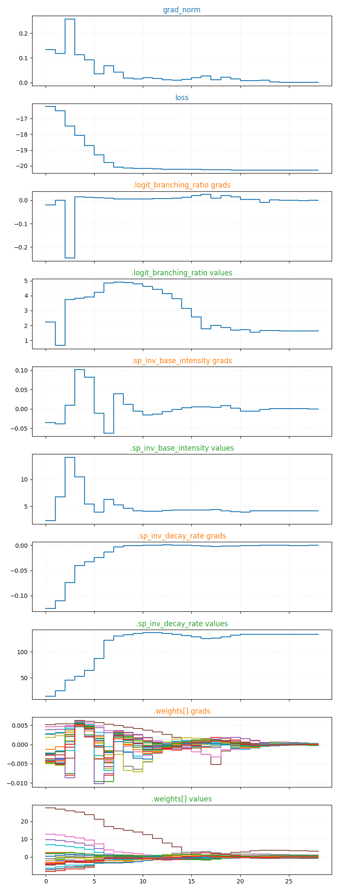
  <br>Fig 18: rbf_hawkes convergence
</p>
</details>


<details>
<summary>Seasonal Basis Functions</summary>
<p align="center">
  
  <br>Fig 20: rbf_hawkes bases
</p>
</details>

<details>
<summary>Predictions</summary>
<p align="center">
  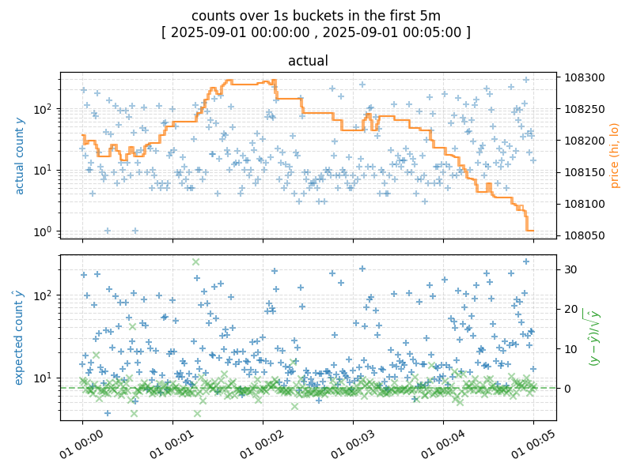
  <br>Fig 19: rbf_hawkes predictions
</p>
</details>

#### pl_hawkes: 4 param(s), training duration: 17.07s (0.35s/eval)
<details>
<summary>Parameters</summary>
<div align="center">

| param                 |        value |
|-----------------------|--------------|
| sp_inv_base_intensity |  4.6875      |
| logit_branching_ratio |  0.95317     |
| sp_inv_inv_omega      | -8.87706     |
| logit_beta            |  1.80156     |
| base_intensity        |  4.69666     |
| branching_ratio       |  0.721752    |
| inv_omega             |  0.000139544 |
| beta                  |  0.858339    |

Table 13: pl_hawkes parameters
</div>
</details>
<details>
<summary>Diagnostics</summary>
<div align="center">

|                        |    mean |   hess_se |   robust_se |   z_score | p_value   |   se_ratio |
|------------------------|---------|-----------|-------------|-----------|-----------|------------|
| .sp_inv_base_intensity |  4.6875 |    0.0014 |      0.0019 |   2494.48 | 0.00%     |     1.3214 |
| .logit_branching_ratio |  0.9532 |    0.0004 |      0.002  |    479.52 | 0.00%     |     5.2997 |
| .sp_inv_inv_omega      | -8.8771 |    0.0002 |      0.0006 | -14660.3  | 0.00%     |     3.2892 |
| .logit_beta            |  1.8016 |    0.0004 |      0.0006 |   3014.49 | 0.00%     |     1.3526 |

Table 14: pl_hawkes diagnostics
</div>
</details>

<details>
<summary>Inverse Hessian</summary>
<p align="center">
  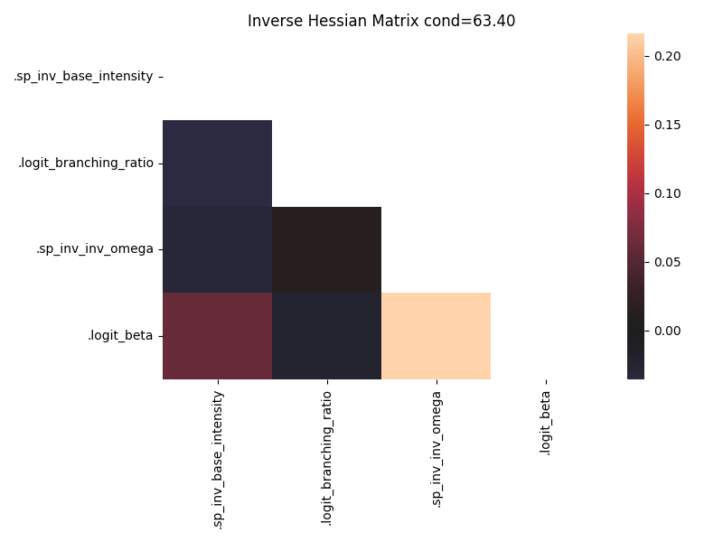
  <br>Fig 21: pl_hawkes inverse Hessian
</p>
</details>
<details>
<summary>Convergence</summary>
<p align="center">
  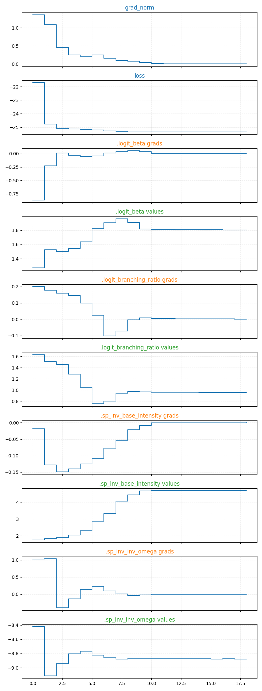
  <br>Fig 22: pl_hawkes convergence
</p>
</details>


<details>
<summary>Predictions</summary>
<p align="center">
  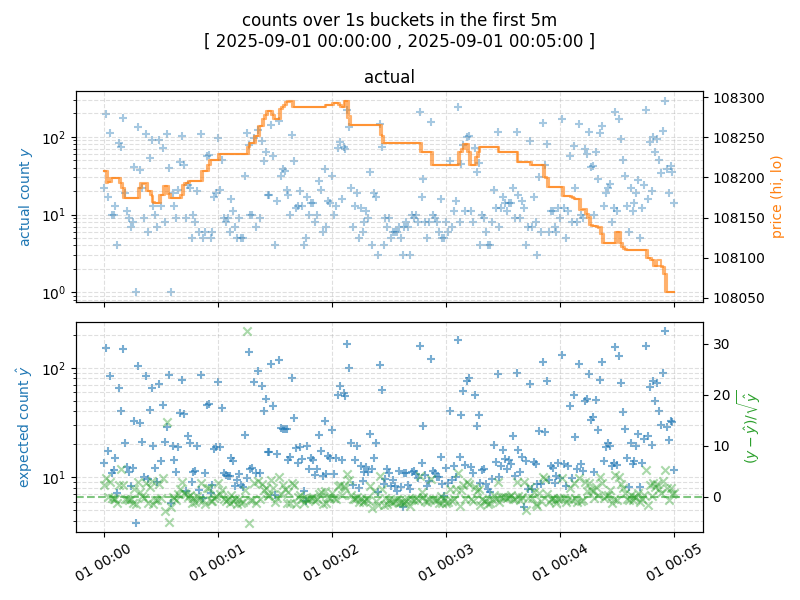
  <br>Fig 23: pl_hawkes predictions
</p>
</details>

## Known Limitations and Future Work
1. `Trading Applications`
    * By integrating the models into a trading system and observing their commercial impact, it becomes clear which parts of the model to prioritise
1. [`Modelling Assumptions`](#modelling-assumptions)
    * Stationarity
        * Regimes can change very quickly as this is crypto
        * The model could be refitted frequently on recent data, or make some adjustment so that the parameters update dynamically
    * Multiple Events per Timestamp
        * Because multiple events may correspond to the aggressive order, the conditional iid assumption is suspect
        * This can be addressed by using a marked Hawkes process, where the mark could be the count, volume or notional value of orders filled at a timestamp, or by using a nonlinear impact kernel
1. `Regularisation`
    * Penalties were chosen heuristically by observing the convergence, identifiability and misspecification diagnostics
    * Consequently, inverse Hessian matrices may be overly optimistic about  identifiability
    * Regularisation parameters can instead be systematically tuned using cross-validation
1. `Bayesian Statistics`
    * The aforementioned regularisation parameters can be replaced with prior distributions to allow a Bayesian interpretation
    * Given that the parameters are continuous and the models are differentiable, efficient gradient-aware MCMC samplers such as HMC and NUTS can be used
1. `Computational Efficiency`
    * The L-BFGS training loop forces device-host synchronisation and may be problematic if the number of parameters increase
    * Some steps of the pipeline create $O(n)$ data (e.g., gradient outer products for Godambe Information Matrix, caches for rbf and power-law), and may require refactoring or batching when working with larger datasets


## Conclusion
The relative performance of the Power-Law Hawkes kernel is consistent with apparent long-term memory.

However, the high SE-ratio (Robust SE / Hessian SE) suggests remaining misspecification, likely from exogenous events, non-linear feedback loops (e.g., stop losses, liquidation, automatic deleveraging) or regime shifts.

This work provides a baseline for future research into multivariate (buy, sell) or marked (count, volume) Hawkes models or other non-linear or covariate-driven intensities.


## Appendix

### Project Structure
* `environment.yml` Dependencies
* `point_process.py` Data loading, model definitions, optimisation, diagnostic plots.
* `download_trades.py` Multithreaded logic for downloading Binance UM Futures tick data and saving them to compressed parquet files with delta encoding
* `decayed_counts.py` Implementation and tests for exponential Hawkes state recursion
* `power_law_approx.py` Implementation and tests for power-law kernel approximation
* `generate_reports.py` Generates `README.md`

### Usage
```
conda env create -f environment.yml
conda activate order-flow
python src/download_trades.py
python src/point_process.py
```

### Notable Libraries
JAX, NumPy, Pandas, Polars, PyArrow, Hypothesis